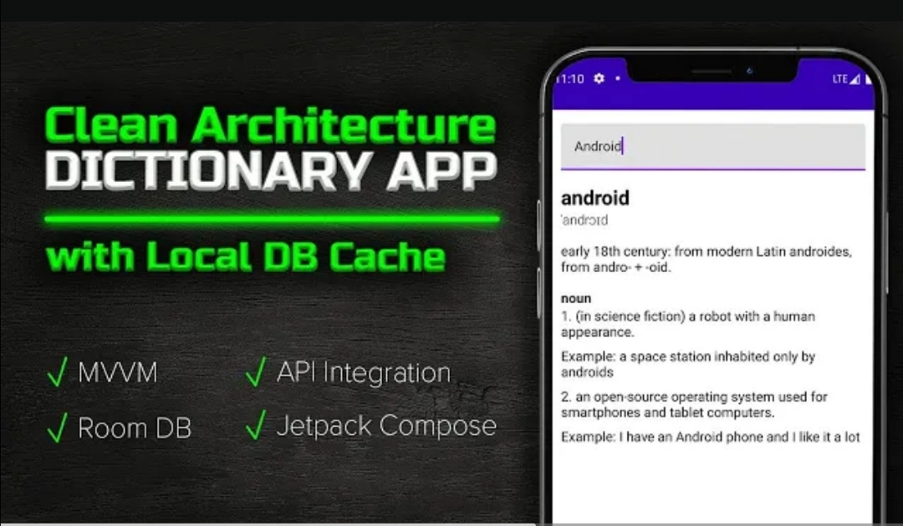

# Dictionary App
Dictionary App is a powerful and user-friendly mobile application designed to help users quickly and easily find definitions, translations, and synonyms for words in multiple languages. This app is built using the Kotlin programming language, offering a seamless and efficient experience for Android users.

## App Preview

## Features

- Search for Words
- Offline Mode
- Detailed Word Information
- User-Friendly Interface

## Acknowledge

In This App i used:
- Jetpack Compose for the design
- Clean Architecture
- Api integration with dictionary api
- RoomDatabase for local database and Cache the api data
- Retrofit for dealing with Api and make http requests
- Use Cases

## Contributing

1. Fork it (<https://github.com/tokhy1/DictionaryApp.git/fork>)
2. Create your feature branch (`git checkout -b feature/fooBar`)
3. Commit your changes (`git commit -am 'Add some fooBar'`)
4. Push to the branch (`git push origin feature/fooBar`)
5. Create a new Pull Request

## Contact 
- Email: <mohamed21346587@gmail.com>
- LinkedIn: [LinkedIn Profile](https://www.linkedin.com/in/mohamed-ashraf-abd-elmoneam-409538246?lipi=urn%3Ali%3Apage%3Ad_flagship3_profile_view_base_contact_details%3BgLq%2BPh0QQX62Mwzt3ozQGQ%3D%3D)

Happy Coding!
